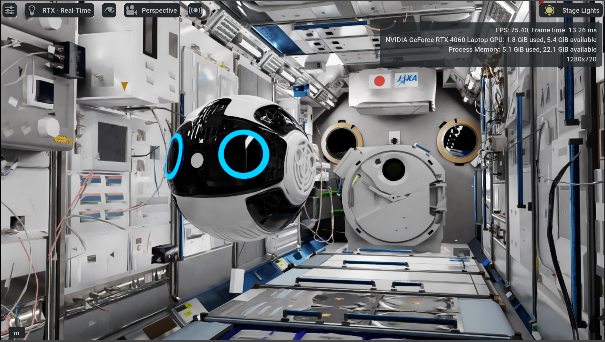
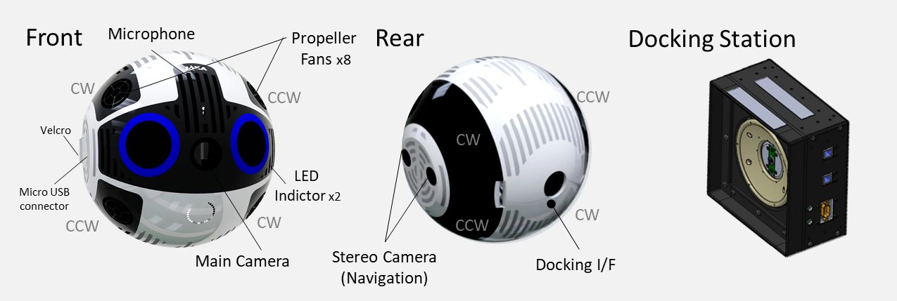
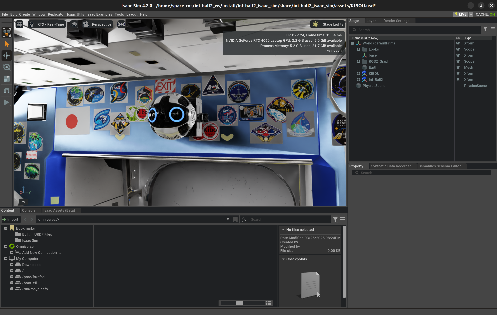
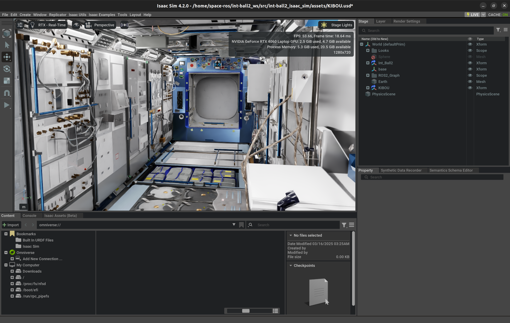
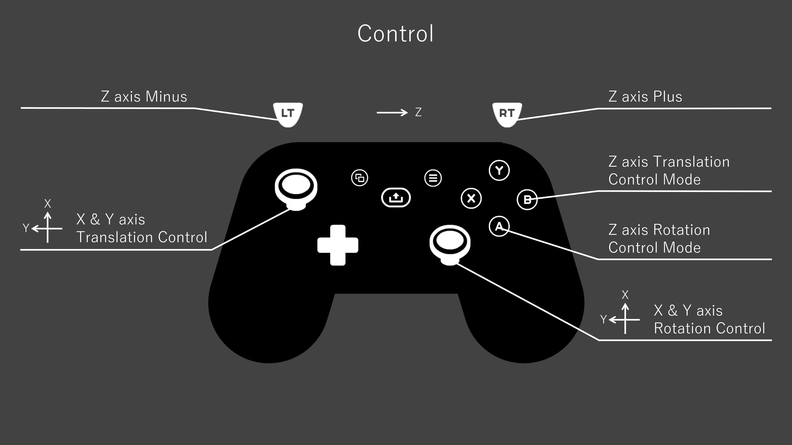
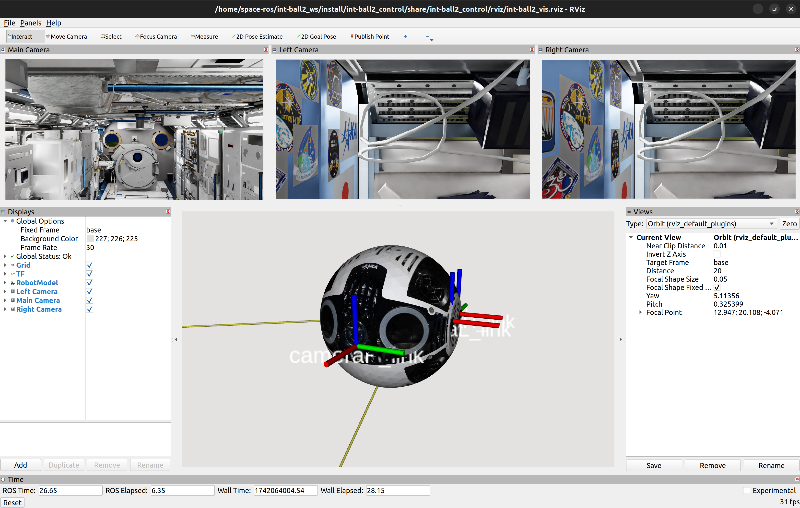

# Int-Ball2 Simulator (Isaac Sim)

[](./README.md)
[](./README_JA.md)


<p style="display: inline">
    
  
  
  
  
</p>



## Table of Contents
1. [**What is Int-Ball2 Simulator (Isaac Sim)**](#what-is-int-ball2-simulator-isaac-sim)

2. [**Prerequisites**](#prerequisites)

3. [**Installation**](#installation)
    1. [Clone Repository](#clone-repository)
    2. [Download Assets and Install Dependencies](#download-assets-and-install-dependencies)

4. [**Usage**](#usage)
    1. [Build & Source](#build--source)
    2. [Launch the Simulator](#launch-the-simulator)
    3. [Feedback from ROS Bridge](#feedback-from-ros-bridge)
    4. [Teleoperation (Joy Controller)](#teleoperation-joy-controller)
    5. [ISS Robot Real Data Replaying](#iss-robot-real-data-replaying)

5. [**Data Visualization**](#data-visualization)

6. [**Acknowledgement**](#acknowledgement)

---

## What is Int-Ball2 Simulator (Isaac Sim)
Int-Ball2 is a free-flying camera robot deployed in the ISS Japan Experimental Module (JEM).
It is remotely controlled from the ground to capture video images and support astronauts.
Additionally, Int-Ball2 can run user-developed software as an extended functionality and can be used as a platform for demonstrating robotic technology in space.

This repository provides ROS tools and a NVIDIA Isaac Sim simulator environment of Int-Ball2.
It simulates Int-Ball2's behavior in the ISS/JEM environment allowing user-developed programs to be tested.



## Prerequisites
In order to use this project, you need to get ready the following environment.

|  Package  |         Version         |
| --------- | ----------------------- |
|   Ubuntu  | 22.04 (Jammy Jellyfish) |
| Isaac Sim |          4.5.0          |
|    ROS    |     Humble Hawksbill    |
|   Python  |          3.10 <=        |

## Installation
### Clone Repository
Make a workspace if you do not have one already.
```bash
mkdir -p ~/int-ball2_ws/src
cd ~/int-ball2_ws/src
```

Clone this package into your workspace.
```bash
git clone https://github.com/sd-robotics/int-ball2_isaac_sim.git
```

### Download Assets and Install Dependencies
Move into this project folder.
```bash
cd ~/int-ball2_ws/src/int-ball2_isaac_sim
```

Download the assets (Int-Ball2, JEM, etc) and install software dependencies.
```bash
bash install_local.sh
```

## Usage
### Build & Source
Build this package and source your workspace.
```bash
cd ~/int-ball2_ws
colcon build --symlink-install
source install/setup.bash
```

### Launch the Simulator
Launch the simulation by ros2 launch.
```bash
ros2 launch ib2_isaac_sim int-ball2_isaac_sim.launch.py usd_file:="KIBOU.usd"
```

> [!NOTE]
> If no `ROS_DOMAIN_ID` is set, ID `0` will be used as default value.

In order to start the Isaac Sim simulation you need to  press the “▶” button on the left side of the screen.
Then ROS bridge will run in Isaac Sim and make possible the connection with Int-Ball2 sensors and propulsion systems.



You can also change the perspective to look around the ISS Kibo (Japanese Experiment Module) environment.



> [!TIP]
> If you are using laptop to run Isaac Sim and suffering the problem of monitor freezing when Isaac Sim is launched, you might want to switch the system to use the NVIDIA GPU by the following command.
> ```bash
> sudo prime-select nvidia
> ```
>
> This will result in a better performance in graphic-intensive tasks. To check if your laptop has successfully switched to NVIDIA GPU, you can use the command.
> ```bash
> prime-select query
> ```

### Feedback from ROS Bridge
The following data can be obtained by the user program.

| Type  |    ROS Definition Name    |                                      Overview                                         |
| ----- | ------------------------- | ------------------------------------------------------------------------------------- | 
| Topic | /camera_main/image_raw    | Image of the main camera on the front of the Int-Ball2.                               |
| Topic | /camera_main/camera_info  | Information about the main camera on the front of Int-Ball2.                          |
| Topic | /camera_left/image_raw    | Image of the stereo camera on the left side of Int-Ball2 (left).                      |
| Topic | /camera_left/camera_info  | Information on the stereo camera on the left side of Int-Ball2 (left).                |
| Topic | /camera_right/image_raw   | Image of the stereo camera on the left side of Int-Ball2 (right).                     |
| Topic | /camera_right/camera_info | Information on the stereo camera on the left side of Int-Ball2 (right).               |
| Topic | /imu/imu                  | Sensor value of the IMU (Inertial Measurement Unit).                                  |
| Topic | /ground_truth             | True value of the robot position and orientation (docking station to Int-Ball2 body). |

The following data can be controlled by the user program.

| Type  |    ROS Definition Name    |                                            Overview                                   |
| ----- | ------------------------- | ------------------------------------------------------------------------------------- | 
| Topic | /ctl/wrench               | Input values of the force and torque applied to Int-Ball2.                            |

### Teleoperation (Joy Controller)
Source your workspace.
```bash
cd ~/int-ball2_ws
source install/setup.bash
```

Make sure that you have a controller (such as DualShock4) connected to the PC before running the command.
Then run the teleop launcher.
```bash
ros2 launch ib2_control int-ball2_teleop.launch.py
```

Operation with the controller is as follows.

For translational movement:
- Left stick for X-axis and Y-axis,
- B button + RT or LT for Z-axis.

For rotational movement:
- Right stick for X-axis and Y-axis,
- A button + RT or LT for Z-axis.




### ISS Robot Real Data Replaying

SpaceData had the opportunity to collect data of the actual Int-Ball2 in the ISS.
Those ROSBags are publicily available in [HuggingFace](https://huggingface.co/datasets/SpaceData/int-ball2_data_on_iss) and can be replayed in our simulator.

1. Lets download the ROSBag data using the [HuggingFace CLI](https://huggingface.co/docs/huggingface_hub/main/en/guides/cli).
```bash
cd ~/int-ball2_ws/src/int-ball2_isaac_sim/int-ball2_data_replay/
# Choose the ROSbag you want to download
huggingface-cli download --repo-type dataset --local-dir ./ SpaceData/int-ball2_data_on_iss bags/rosbag_20250421111514.bag
```
2. Remember that the actual Int-Ball2 runs on ROS Melodic, then we need to convert the ROSBag so that is playable in ROS2 using [Rosbags](https://gitlab.com/ternaris/rosbags).
```bash
cd bags/
rosbags-convert --src rosbag_20250421111514.bag --dst-storage sqlite3 --dst ./rosbag2_20250421111514
```
3. Now, lets launch Isaac Sim with the updated ROSBag.
```bash
ros2 launch ib2_isaac_sim int-ball2_issbag_demo.launch.py bag_file:="<ABSOLUTE/PATH/TO/ROSBAG>"
```


## Data Visualization
Source your workspace.
```bash
cd ~/int-ball2_ws
source install/setup.bash
```

Launch Rviz to visualize the obtained data.
```bash
ros2 launch ib2_control rviz_visualize.launch.py 
```



## Citation
If you use this platform for your research, please cite as follows:
```
[1] SpaceData Inc., 2025, int-ball2_isaac_sim (Version v1.0.0) [Source code], GitHub, Available at: https://github.com/sd-robotics/int-ball2_isaac_sim.
```

## Acknowledgement
This simulator was developed by Space Data Inc. in cooperation with JAXA within the framework of the Space Innovation Partnership (J-SPARC: JAXA Space Innovation through Partnership and Co-creation).

> [!TIP]
> This document includes content from JAXA's Int-Ball2 Simulator, which is licensed under the Apache License 2.0.
> - [Int-Ball2 Simulator (Gazebo)](https://github.com/jaxa/int-ball2_simulator)

---

[Back to Top](#int-ball2-simulator-isaac-sim)
